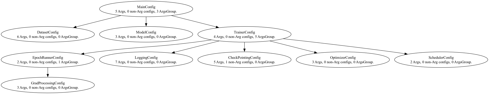

# Overview
- **Dynamic nested configs**. Separate things should be separate. Related things should be together.
  - Dynamically add children args when certain args are added to avoid namespace cluttering/collision and management.
  - Configs for a certain class are easy to locate (file-naming).
  - Highly modular (easy to add/remove) -- utilize OOP.
- **Dynamic defaults** that select the best possible configurations possible and are dynamic depending on the task.
  - Defaults should already be pretty good and should adapt to users' previous selection (e.g. default model changes from ResNet50 to BERT when the user change the dataset from ImageNet to IMDB).
- **Developer/IDE friendly**. Configs names and types are visible to the IDE (which wasn't the case with standard argparse)
  - **Easy refactoring**. Since configs names are visible, refactoring (renaming, moving, etc.) can utilize IDE (like Pycharm) tools.
  - **Less mistyping**. Since the IDE can check for the type and name  of the config.
- **User friendly**. Easy to see all available configs, which are grouped and ordered according to their definition and parse ordering. Show help and defaults for all configs. 
  - **Generous error checking**. Built-in constraint and dependencies checking across multiple steps to minimize error. 
  - **Nice printing**. Print configs nicely by group.
  - **Compartmenalization**. Only expose relevant variables to the CLI. Nested structure helps prevent name collisions.

TODO:
- Automatically generate step-by-step GUI. 

### Example `MainConf` layout:


# Basics
In this section, we describe typically configs workflow and how they are implemented.
### Basic datatypes for configs 
There are 3 basic units for specifying configs: `Arg`, `ArgsGroup`, and `ArgParser`.
- `Arg`: This object is responsible for the front-end and is similar to Python's `argparse`'s `add_argument` method. This object contains more information for advanced configurations (see advanced Arg configs section below).
- `ArgsGroup`: This class is responsible for bridging between the `dataclass` used for configs in the backend and the `Arg` in the front end. It contains other `ArgsGroup` to define a nested structure (a *tree*) for configurations compartmentalization.
  - This class contains 3 main types of attributes: `Arg`, children `ArgsGroup`, and non-args attributes.
  - The `Arg` objects in this class only lives until the `ArgsGroup` is configured via `ArgParse`'s parsing. After it is parsed, all the attributes in this class are either `ArgsGroup` or attributes (`str, int, float, etc.`) used for configurations.
  - By inheriting `ArgsGroup` and adding `Arg` attributes, we can configure a `dataclass` class into a parsable `ArgsGroup`.
- `ArgParser`: This class handles parsing `ArgsGroup` tree and setting defaults
  - It should consume all the `Arg`s inside an `ArgsGroup` once it has finished parsing.
  - It performs more advanced functionalities like running type, constraint, and dependencies checking while setting args.
  - It also handles setting defaults and dynamic defaults.

See the sections below on basic configs workflow: adding new configs, parsing configs, setting defaults, etc.

After all these steps, configs in `ArgsGroup` can be used as a standard nested dot-notation enabled
## Adding new configs 

To create a brand-new configs and make it visible to the argparser, one needs to perform the following 3 steps:
1. Create a `@dataclass` for the configs of a class
   1. Ideally all the defaults should work out of the box (there are exceptions).
   2. Some attributes will usually be fixed and some attributes we will want to argparse.  
   
   Example:
```python
@dataclass
class LoggingConfig:
    log_dir: str = 'MYDIR'
    log_gradient: bool = False
    log_every: int = 100  # number of steps before log
    ...  # more configs param
```
2. Inherit from `configs/ArgsGroup.py:ArgsGroup`. Implement a `__post_init__` special method for `dataclass` to initialize the `ArgsGroup` with an appropriate name, description, and parent ArgsGroup. In the `__post_init__`, we can also define children `ArgsGroup` in the `__post_init__` to set their parents to `self`.
   1. This will allow the new configs group to be visible to the argparser as long as we put the new configs inside one of the existing visible `ArgsGroup` (at least the root config at `configs/MainConfig`).
   2. The location where we put the new config class should be dependent on where we use it and where we want the configs to be used.

    Example:
```python
@dataclass
class LoggingConfig(ArgsGroup):

    def __post_init__(self):
        ArgsGroup.__init__(self, name="logging", description="Logging related configs") 
        # define optional children configs below
        # this is another ArgsGroup which will automatically be parsed when included in the parent ArgsGroup
        self.child_configs: ArgsGroup = ChildConfig()  

         
    # configs and args below
```

3. For the configs that need to be visible to the argparser, change the default to one of the class in the `config/Args.py` file. Fill out as many of the fields as possible (`help`, `choices`, `action`, etc.) but we require that `name` and `default` be filled.
   1. Currently, we have `IntArg, FloatArg, BoolArg, StrArg`. One can follow the class definitions there to extend `Arg` to new types.
   2. Use `dataclasses`'s `field` and `default_factory` if needed for mutable args.
    
   Example:
```python
@dataclass
class LoggingConfig(ArgsGroup):
    ...  # post_init above
    log_dir: str = StrArg(
        "log_dir", default="AUTO",
        help="Location to save log related files and checkpoints. Default: Auto dir"
    )
    log_gradients: bool = BoolArg(
        "log_gradients", default=False, action="store_true",
        help="Log gradients of batches during training epoch"
    )
    log_every: int = IntArg(
        "--log_every", default=DYNAMIC_DEFAULT, type=int,
        help=f"Log every step. Default:{default_args_dict['log_every']}."
    )
```
To add a new arg inside an existing config that is already an `ArgsGroup`, we just need to do step 3 above to an attribute of an existing `ArgsGroup`.

## Parsing configs
Initialize an `ArgParser` object from `configs/ArgParser` and pass in the root ArgsGroup. 
See example below (that is taken from `main.py`):
```python
from example.global_vars import default_data_setting_dict, default_args_dict

args = MainConfig()  # initialize config tree
parser = ArgParser(args)  # initialize parser at the root
parser.parse_args_recursively()  # parse args in a BFS manner 
# set defaults according to global_vars default data dicts
parser.set_dynamic_defaults('dataset', default_data_setting_dict, default_args_dict)
```
The method `parse_args_recursively` will iterate through each `ArgsGroup`, create a parser, 
add all the arguments to the parser, and then parse known args from the command line.
Each step will populate and consume the `Arg`s inside each `ArgsGroup`. 

For defaults, see the sections below for more details.
## Defaults
Configs defaults are very important in reducing cognitive load while trying to set a configuration file. 
For complex applications, defaults 

### `Arg`'s standard defaults
These defaults are used for the Arg whenever users do not explicit specify their values.
These are similar to argparse.ArgumentParser's defaults. We set the `default` attribute to the default value in this case.

### Dynamic defaults
NOTE: The override ordering is always user_input > dynamic_defaults > standard_defaults.

Dynamic defaults are defaults that are set depending on the value of another arg. 
For example, the default value for n_epochs might differ whether we are training on MNIST (50k examples) or The Pile (billions of tokens).
Another example is that the default optimizer/lr-scheduler might change depending on what model we are using (ResNet vs. Transformer and Adam vs AdamW).
Many parameters need dynamic defaults so that things make sense on different dataset/model.

To set dynamic default, we need to create a dictionary with:
1. `'dynamic_default_field': <default field>` key-value pair. This pair indicate which field should the dynamic default be set to. For example, if we are setting the default dynamically depending on the selected dataset, we would set 
```python
'dynamic_default_field': 'dataset'
```

2. `<default field value>: <dynamic default>`: key-value pair. This pair matches the default field to the corresponding dynamic default value. For example:
```python
'imagenet': 'resnet50', 'wikitext': 'gptbase'
```

See an example for setting `model` arg below:
```python
model: str = StrArg(
    "model", choices=['resnet50', 'gptbase', 'bert'],
    dynamic_defaults_dict={
        'dynamic_default_field': 'dataset', 
        'imagenet': 'resnet50', 
        'wikitext': 'gptbase',
        'imdb': 'bert'
    }
)
```
The default for this `Arg` is set dynamically and will depend on the choice of the `dataset` given by the `dynamic_defaults_dict`.

#### Setting the `dynamic_defaults_dict` for multiple settings
Often times, multiple configurations' dynamic defaults depend on a certain setting (e.g. model, optimizer, etc. all depend on the dataset). 
There, it is desirable to set all the configurations in one place. For example, for the `wikitext` dataset, we might want the defaults to be of the following   
```python
'wikitext': {'model': 'gptbase', 'batch_size': 4, 'optimizer': 'adamw', 'scheduler': 'one_cycle',
             'weight_decay': 0.1, 'lr': 1e-3, 'dropout': 0.1, 'log_every': 100, 'n_epochs': 1,
             'sequence_length': 4096, 'turn_on_torch_amp_autocast': True, 'n_accumulate_batches': 4,
             'pct_start': 0.02}
```
Specifying `dynamic_defaults_dict` like above will also work and is the preferred way. We can pass the same dictionary to multiple `Arg`s 
and managing the dynamic defaults this way is much easier too since all the configs for the same dataset (or any other config) are all in one place. 

Above, if `wikitext` is selected, the `model` will be set to `gptbase` as default. If we enable dynamic defaults for the other fields, they will also be set automatically.

#### Dynamic defaults dependent Args ordering
Specifying dynamic defaults will create a dependency graph. There should not be any cycle in this dependency graph.

If `Arg foo`'s dynamic default _depends_ on `Arg bar`, we must parse `bar` before `foo` via 3 ways:
- If `foo` lives inside an `ArgsGroup` that is a _child_ of the `ArgsGroup` containing `bar`, then we are okay.
- If `foo` lives inside an `ArgsGroup` that is a _sibling_ (i.e. they share the same parent) of the `ArgsGroup` containing `bar`, then the `ArgsGroup` containing `bar` must be parsed before the one containing `foo`.
  - The above can be done by explicitly defining `foo`'s `ArgsGroup` _after_ `bar`'s `ArgsGroup`.
- If both `foo` and `bar` live in the same `ArgsGroup`, then `bar` must be defined before `foo`.

The above conditions are true since the recursive parser parses attributes in the order that they are defined.

## Arg advance specification 
These are more advance specification to ensure better user interface. 
Configuring these specifications can allow automatic GUI step-by-step generation.
### Args Constraints 
One can pass in a function in `Arg`'s `constraint_check_fn` that maps from the `Arg`'s value to a boolean value returning whether if the value is true or not.
During parsing, after processing the value and just before setting the config, we check the constraint.

Example:
```python
log_every: int = IntArg(
    "--log_every", type=int,
    help=f"Log every step. Default: 50.",
    constraint_check_fn=lambda x: x > 0    # constraint  that log_every must be > 0
)
```

### Args dependencies  (TODO)
Setting one Arg can limit the potential choices for another (this is mainly for GUI generation?)

TODO:
- Specification: dict of 'name_of_dependency': Dependency object.
  - Dependency object will contain:
    - Variable that points to the dependent Arg (e.g. dataset_config.dataset). A dependency object can only be created after the dependent Arg is created. 
    - A map that, given a value of the dependent Arg, returns a list of valid choices.
### Args children configs 
Some args can spawn children configs (for example `optimizer=sgd` spawns `momentum` or `optimizer=adam` spawns `beta1, beta2`. 
Similarly `model=resnet` will spawn different specific model configs in comparison to `model=transformer`.)
- Create a separate `ArgsGroup` for the children Args to be spawned
  - In the child's `ArgsGroup`, be sure to provide a `field_name` when initialize the `ArgsGroup`.
  - After everything is parsed, the child's ArgsGroup will be attached to the parent with the field's name as specified in `field_name`.
- In the parent `ArgsGroup`, in the `Arg` specification for the `Arg` responsible for spawning the child `ArgsGroup`, pass in a dictionary mapping from the value of the `Arg` to the child `ArgsGroup` class to be spawned.

**Example**: Suppose we want to spawn extra args for the OneCycleLR scheduler, we can do that with the code below:
```python
# we make a separate ArgsGroup for the child
@dataclass
class OneCycleLRConfig(ArgsGroup):
    field_name: str = 'one_cycle'  # we need to set field_name for children ArgsGroup

    def __post_init__(self):
        ArgsGroup.__init__(self, "OneCycleLRConfig", "OneCycleLR scheduler related configs",
                           field_name=self.field_name)

    max_lr: float = FloatArg(
        "max_lr", default=1,
        help="Maximum learning rate for the OneCycleLR scheduler."
    )
    anneal_strategy: str = StrArg(
        "anneal_strategy", choices=['cos', 'linear', 'none'], default='cos',
        help='Anneal strategy for OneCycleLR scheduler.'
    )


#  (in SchedulerConfig) we add a dictionary mapping from the choice to the ArgsGroup in the `children_args` field.
    scheduler: str = StrArg(
        "scheduler", choices=AVAIL_SCHEDULERS,
        help=f"Default is None.",
        dynamic_defaults_dict=default_data_dict,
        children_args={'one_cycle': OneCycleLRConfig},
    )

```

# Importing and exporting configs (TODO)
Currently, the only way to set configs is via parsing (and setting defaults) on them.
It would be convenient to handle these I/Os via files.

## Exporting configs
- `ArgsGroup` have methods to output nested dictionaries format.

TODO:
- Export to file format for checkpointing and running from

## Importing configs
TODO: 
- Implement method to load flattened dictionary
- Load from dictionary, JSON, YAML, etc

    
# Example of adding an ArgsGroup that is generated dynamically
Suppose we start with a standard "Configs as dataclass" construction:
```python
@dataclass
class GPTBaseConfigs:
	vocab_size: int = 50304
	n_embd: int = 768
	sequence_length: int = 4096
	bias: bool = False
	n_layer: int = 12 
	n_head: int = 4
	dtype: torch.dtype = torch.bfloat16
```

First add some import statements

```python
from configs.ArgsGroup import ArgsGroup
from configs.Arg import IntArg
from global_vars import default_data_setting_dict
```

Then inherit the dataclass with `ArgsGroup` and add some initialization methods
```python
@dataclass
class GPTBaseConfigs(ArgsGroup):
    field_name: str = 'gpt_base_configs'

    def __post_init__(self):
        ArgsGroup.__init__(self, "GPTBaseConfigs", "GPTBase models' configs",
                           field_name=self.field_name)

    vocab_size: int = 50304
    ...[other args ommitted]...
    dropout: float = 0.2
```

Then for the configs that we want to turn into an `Arg`, configure them to Args.
```python
@dataclass
class GPTBaseConfigs(ArgsGroup):
    ... [init methods]...
    vocab_size: int = 50304
    n_embd: int = 768
    sequence_length: int = 4096
    bias: bool = False
    n_layer: int = IntArg(name="n_layer", default=12, help="Set n_layer for GPTBase model. Default is 12.")
    n_head: int = IntArg(name="n_head", default=4, help="Set n_head for GPTBase model. Default is 4.")
    dtype: torch.dtype = Arg(name="dtype", default=torch.bfloat16,
                             help="Set the training type for GPTBase model. Default is torch.bfloat16.")
    dropout: float = 0.2
```

Finally, add this class as a child class in an appropriate `ArgsGroup` that is already included in the `MainArgsGroup` (root)
OR add it as a dynamically generated child's args.
```python
model: str = StrArg(
    "model", choices=AVAIL_MODELS, default='resnet50',
    dynamic_defaults_dict=default_data_setting_dict,
    children_args={'gptbase': GPTBaseConfigs},
)
```